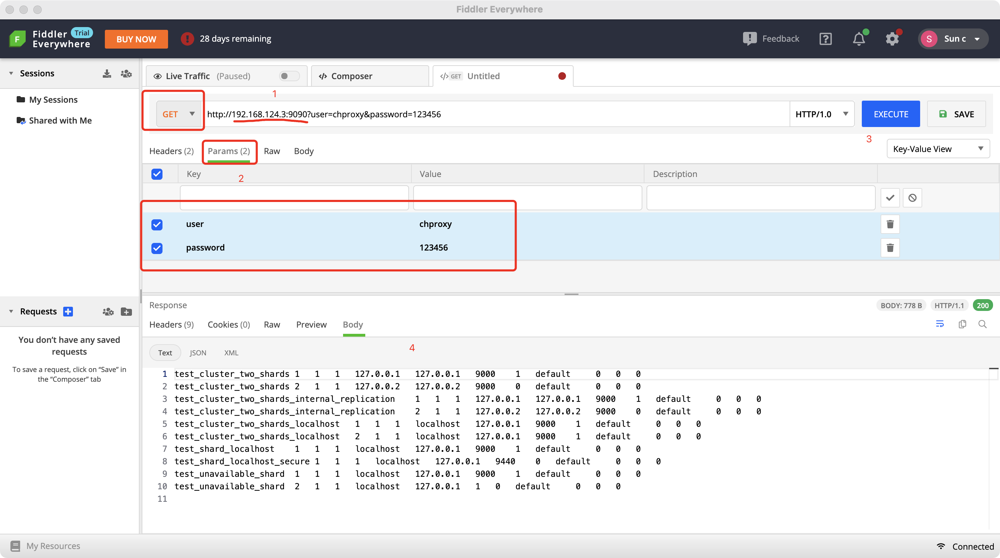

# Chproxy 学习实践

## 编译
clone 下来以后 运行 `go build` 即可

## docker部署
`go build` 生成chproxy可执行文件复制到proxy文件目录下

```bash
.
├── Dockerfile
└── proxy
    ├── chproxy
    └── config.yml
```

Dockerfile
```shell
FROM alpine

#COPY ./chproxy /chproxy
COPY ./proxy/* /
RUN mkdir /lib64 && ln -s /lib/libc.musl-x86_64.so.1 /lib64/ld-linux-x86-64.so.2

ENTRYPOINT [ "/chproxy", "-config=/config.yml"]
```

生成docker容器：
```bash
docker build . -t chproxy:0.2
docker rm -f chproxy && docker run -tid --name chproxy 752e60bbec56 /bin/sh
```

## 配置测试：

```yaml
# 测试配置
# 日志级别
log_debug: true

server:
  http:
    # echo 'select * from system.clusters' | curl 'http://192.168.124.3:9090/?user=admin&password=123456' --data-binary @-
    listen_addr: "192.168.124.3:9090"
    allowed_networks: ["127.0.0.0/24", "192.168.124.0/24"]

users:
  - name: "admin"
    password: "123456"
    to_cluster: "cluster_1st"
    to_user: "admin"
    max_queue_size: 40
    max_queue_time: 25s
    cache: "root_cache"
  - name: "superset"
    to_cluster: "cluster_1st"
    to_user: "superset"
    max_queue_size: 40
    max_queue_time: 25s
    cache: "superset_cache"
  - name: "web"
    to_cluster: "cluster_1st"
    to_user: "web"
    max_queue_size: 40
    max_queue_time: 25s
    cache: "web_cache"
  - name: "sinker"
    to_cluster: "cluster_1st"
    to_user: "sinker"
    max_queue_size: 40
    max_queue_time: 25s

clusters:
  # 集群名
  - name: "default"
    # 集群列表
    nodes: ["192.168.180.128:8123"]
    # 访问ch 账号密码
    users:
      - name: "admin"
        password: "V%t^ckmstB"
      - name: "read"
        password: "5p0ZUUuO80"
      - name: "sinker"
        password: "9dSw_nPnRn"
      - name: "web"
        password: "9dSw_nPnRn"
      - name: "superset"
        password: "superset"
        
caches:
  - name: "root_cache"
    dir: "/ch_tmp/cache/admin"
    max_size: 150Mb
    expire: 120s
  - name: "web_cache"
    dir: "/ch_tmp/cache/web"
    max_size: 150Mb
    expire: 120s
  - name: "superset_cache"
    dir: "/ch_tmp/cache/superset"
    max_size: 150Mb
    expire: 120s       
```


## 终端请求测试：

```shell
➜  ~ echo 'select * from system.clusters' | curl 'http://192.168.124.3:9090/?user=admin&password=123456' --data-binary @-
test_cluster_two_shards	1	1	1	127.0.0.1	127.0.0.1	9000	1	default		0	0	0
test_cluster_two_shards	2	1	1	127.0.0.2	127.0.0.2	9000	0	default		0	0	0
test_cluster_two_shards_internal_replication	1	1	1	127.0.0.1	127.0.0.1	9000	1	default		0	0	0
test_cluster_two_shards_internal_replication	2	1	1	127.0.0.2	127.0.0.2	9000	0	default		0	0	0
test_cluster_two_shards_localhost	1	1	1	localhost	127.0.0.1	9000	1	default		0	0	0
test_cluster_two_shards_localhost	2	1	1	localhost	127.0.0.1	9000	1	default		0	0	0
test_shard_localhost	1	1	1	localhost	127.0.0.1	9000	1	default		0	0	0
test_shard_localhost_secure	1	1	1	localhost	127.0.0.1	9440	0	default		0	0	0
test_unavailable_shard	1	1	1	localhost	127.0.0.1	9000	1	default		0	0	0
test_unavailable_shard	2	1	1	localhost	127.0.0.1	1	0	default		0	0	0
➜  ~
```

```shell
# echo "show databases;" | curl -u chproxy: --data-binary @- 127.0.0.1:9090
# echo "select hostname()" | curl -u chproxy: --data-binary @- 127.0.0.1:9090
# echo "insert into test.insert_test values (2, 'aaaa');" | curl -u chproxy: --data-binary @- 127.0.0.1:9090
# echo "select * from test.insert_test;" | curl -u proxy -cache_namespace=shortterm: --data-binary @- 127.0.0.1:9090

```

## 工具模拟测试：




